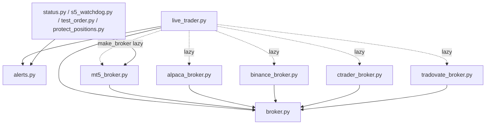

# CODE INVENTORY

_Generated audit of every root `.py` file (143). No files moved/changed — inventory only._

## Category counts

- **Experiment**: 62
- **Strategy**: 20
- **Research**: 19
- **Obsolete**: 14
- **Utility**: 12
- **Broker**: 6
- **Duplicate**: 5
- **Test**: 3
- **Execution**: 1
- **Core Production**: 1

## Dependency core (imported as modules by other files)

Only these are real modules; everything else is a standalone script (entry point / orphan):

`alerts.py`, `broker.py`, `mean_reversion_test.py`, `mt5_broker.py`, `verify_liveness.py`

## Full inventory

| File | Category | Purpose | Status | V2 Destination | Action |
|---|---|---|---|---|---|
| `abnormal_volume_backtest.py` | Strategy | backtest source for a validated/edge strategy | reference | research/strategies/ | Archive |
| `add_debug.py` | Obsolete | one-off debug/patch scaffold | stale | - | Archive |
| `alerts.py` | Execution | Telegram/email alert sink | active | src/exec/ | Keep |
| `alpaca_broker.py` | Broker | venue adapter | active | src/brokers/ | Keep |
| `alpaca_paper_trader.py` | Obsolete | superseded by live_trader.py | stale | - | Archive |
| `alpaca_universe_sweep.py` | Research | validation / gauntlet / reporting tool | active | research/ | Keep |
| `analyze_weak_simple.py` | Research | validation / gauntlet / reporting tool | active | research/ | Keep |
| `analyze_weak_strategies.py` | Research | validation / gauntlet / reporting tool | active | research/ | Keep |
| `asian_breakout_test.py` | Experiment | rejected/exploratory idea backtest | rejected | research/archive/ | Archive |
| `backtest.py` | Experiment | rejected/exploratory idea backtest | rejected | research/archive/ | Archive |
| `binance_broker.py` | Broker | venue adapter | active | src/brokers/ | Keep |
| `break_even_sharpe.py` | Research | validation / gauntlet / reporting tool | active | research/ | Keep |
| `broker.py` | Broker | venue adapter | active | src/brokers/ | Keep |
| `btc_asian_sweep.py` | Strategy | backtest source for a validated/edge strategy | reference | research/strategies/ | Archive |
| `btc_funding_m2.py` | Experiment | rejected/exploratory idea backtest | rejected | research/archive/ | Archive |
| `btc_funding_reversal.py` | Experiment | rejected/exploratory idea backtest | rejected | research/archive/ | Archive |
| `btc_meanrev.py` | Experiment | rejected/exploratory idea backtest | rejected | research/archive/ | Archive |
| `btc_sweep_test.py` | Experiment | rejected/exploratory idea backtest | rejected | research/archive/ | Archive |
| `btc_validate.py` | Research | validation / gauntlet / reporting tool | active | research/ | Keep |
| `cac_meanrev.py` | Experiment | rejected/exploratory idea backtest | rejected | research/archive/ | Archive |
| `cfd_validate.py` | Research | validation / gauntlet / reporting tool | active | research/ | Keep |
| `check_health.py` | Utility | ops/health/verify tool | active | tools/ | Keep |
| `check_nikkei.py` | Experiment | ad-hoc sanity check | stale | - | Archive |
| `combined_3pillar.py` | Experiment | rejected/exploratory idea backtest | rejected | research/archive/ | Archive |
| `combined_backtest.py` | Experiment | rejected/exploratory idea backtest | rejected | research/archive/ | Archive |
| `combined_yearly.py` | Experiment | rejected/exploratory idea backtest | rejected | research/archive/ | Archive |
| `commodity_carry.py` | Experiment | rejected/exploratory idea backtest | rejected | research/archive/ | Archive |
| `compare_strategies.py` | Experiment | rejected/exploratory idea backtest | rejected | research/archive/ | Archive |
| `conformal_overlay.py` | Research | validation / gauntlet / reporting tool | active | research/ | Keep |
| `cot_hedging_signal.py` | Experiment | rejected/exploratory idea backtest | rejected | research/archive/ | Archive |
| `cot_oil_strategy.py` | Experiment | rejected/exploratory idea backtest | rejected | research/archive/ | Archive |
| `cross_sectional_cot.py` | Experiment | rejected/exploratory idea backtest | rejected | research/archive/ | Archive |
| `cross_sectional_cot_v2.py` | Experiment | rejected/exploratory idea backtest | rejected | research/archive/ | Archive |
| `crypto_commodity_hunt.py` | Experiment | rejected/exploratory idea backtest | rejected | research/archive/ | Archive |
| `ctrader_broker.py` | Broker | venue adapter | active | src/brokers/ | Keep |
| `dax_meanrev.py` | Experiment | rejected/exploratory idea backtest | rejected | research/archive/ | Archive |
| `dax_meanrev_test.py` | Experiment | rejected/exploratory idea backtest | rejected | research/archive/ | Archive |
| `debug_s5s.py` | Obsolete | one-off debug/patch scaffold | stale | - | Archive |
| `debug_weights.py` | Obsolete | one-off debug/patch scaffold | stale | - | Archive |
| `debug_weights2.py` | Obsolete | one-off debug/patch scaffold | stale | - | Archive |
| `decay_aware_strategy_management.py` | Research | validation / gauntlet / reporting tool | active | research/ | Keep |
| `diag_live.py` | Utility | ops/health/verify tool | active | tools/ | Keep |
| `dix_filter_test.py` | Experiment | rejected/exploratory idea backtest | rejected | research/archive/ | Archive |
| `download_data.py` | Utility | market-data fetcher | active | src/data/ | Keep |
| `dynamic_exits_test.py` | Experiment | rejected/exploratory idea backtest | rejected | research/archive/ | Archive |
| `edge_hunt.py` | Research | validation / gauntlet / reporting tool | active | research/ | Keep |
| `ensemble_backtest.py` | Experiment | rejected/exploratory idea backtest | rejected | research/archive/ | Archive |
| `ensemble_backtest_test.py` | Experiment | rejected/exploratory idea backtest | rejected | research/archive/ | Archive |
| `eu_indices_sweep.py` | Experiment | rejected/exploratory idea backtest | rejected | research/archive/ | Archive |
| `eurusd_orb_backtest.py` | Experiment | rejected/exploratory idea backtest | rejected | research/archive/ | Archive |
| `fetch_dukascopy.py` | Utility | market-data fetcher | active | src/data/ | Keep |
| `fetch_mt5_history.py` | Utility | market-data fetcher | active | src/data/ | Keep |
| `final_simple_check.py` | Experiment | ad-hoc sanity check | stale | - | Archive |
| `final_sma_test.py` | Duplicate | near-dup SMA test variant | dup | - | Archive |
| `final_sma_test_final.py` | Duplicate | near-dup SMA test variant | dup | - | Archive |
| `final_sma_test_final_fixed.py` | Duplicate | near-dup SMA test variant | dup | - | Archive |
| `final_sma_test_fixed.py` | Duplicate | near-dup SMA test variant | dup | - | Archive |
| `fix_s6entry.py` | Obsolete | one-off debug/patch scaffold | stale | - | Archive |
| `fix_s6exit.py` | Obsolete | one-off debug/patch scaffold | stale | - | Archive |
| `fix_sma.py` | Obsolete | one-off debug/patch scaffold | stale | - | Archive |
| `full_yearly.py` | Research | validation / gauntlet / reporting tool | active | research/ | Keep |
| `funding_carry.py` | Experiment | rejected/exploratory idea backtest | rejected | research/archive/ | Archive |
| `funding_carry_realistic.py` | Experiment | rejected/exploratory idea backtest | rejected | research/archive/ | Archive |
| `funding_carry_strategy.py` | Experiment | rejected/exploratory idea backtest | rejected | research/archive/ | Archive |
| `futures_sweep_test.py` | Experiment | rejected/exploratory idea backtest | rejected | research/archive/ | Archive |
| `gamma_backtest.py` | Strategy | backtest source for a validated/edge strategy | reference | research/strategies/ | Archive |
| `gamma_filter_test.py` | Strategy | backtest source for a validated/edge strategy | reference | research/strategies/ | Archive |
| `gold_backtest.py` | Strategy | backtest source for a validated/edge strategy | reference | research/strategies/ | Archive |
| `gold_backtest_v2.py` | Strategy | backtest source for a validated/edge strategy | reference | research/strategies/ | Archive |
| `intraday_momentum_test.py` | Experiment | rejected/exploratory idea backtest | rejected | research/archive/ | Archive |
| `iv_skew_ab.py` | Experiment | rejected/exploratory idea backtest | rejected | research/archive/ | Archive |
| `live_trader.py` | Core Production | main live engine (all strategies + risk) | active | src/engine/ | Keep |
| `london_breakout_test.py` | Experiment | rejected/exploratory idea backtest | rejected | research/archive/ | Archive |
| `macro_event_filter.py` | Experiment | rejected/exploratory idea backtest | rejected | research/archive/ | Archive |
| `master_backtest.py` | Experiment | rejected/exploratory idea backtest | rejected | research/archive/ | Archive |
| `mean_reversion_basket.py` | Experiment | rejected/exploratory idea backtest | rejected | research/archive/ | Archive |
| `mean_reversion_portfolio.py` | Experiment | rejected/exploratory idea backtest | rejected | research/archive/ | Archive |
| `mean_reversion_test.py` | Experiment | rejected/exploratory idea backtest | rejected | research/archive/ | Archive |
| `meanrev_signal_test.py` | Experiment | rejected/exploratory idea backtest | rejected | research/archive/ | Archive |
| `modify_sma.py` | Obsolete | one-off debug/patch scaffold | stale | - | Archive |
| `mr_gap_test.py` | Research | backtest/analysis script | reference | research/ | Archive |
| `mt5_broker.py` | Broker | venue adapter | active | src/brokers/ | Keep |
| `multi_asset_orb.py` | Experiment | rejected/exploratory idea backtest | rejected | research/archive/ | Archive |
| `multi_etf_backtest.py` | Experiment | rejected/exploratory idea backtest | rejected | research/archive/ | Archive |
| `nikkei_validate.py` | Research | validation / gauntlet / reporting tool | active | research/ | Keep |
| `nq_futures_backtest.py` | Experiment | rejected/exploratory idea backtest | rejected | research/archive/ | Archive |
| `open_breakout_walkforward.py` | Experiment | rejected/exploratory idea backtest | rejected | research/archive/ | Archive |
| `orb_1min.py` | Strategy | backtest source for a validated/edge strategy | reference | research/strategies/ | Archive |
| `orb_5min.py` | Strategy | backtest source for a validated/edge strategy | reference | research/strategies/ | Archive |
| `orb_backtest.py` | Strategy | backtest source for a validated/edge strategy | reference | research/strategies/ | Archive |
| `orderflow_test.py` | Experiment | rejected/exploratory idea backtest | rejected | research/archive/ | Archive |
| `pairs_test.py` | Experiment | rejected/exploratory idea backtest | rejected | research/archive/ | Archive |
| `paper_trade.py` | Obsolete | superseded by live_trader.py | stale | - | Archive |
| `paper_trade_master.py` | Obsolete | superseded by live_trader.py | stale | - | Archive |
| `patch_s6_dict.py` | Obsolete | one-off debug/patch scaffold | stale | - | Archive |
| `patch_strats_and_colors.py` | Obsolete | one-off debug/patch scaffold | stale | - | Archive |
| `perf_report.py` | Research | validation / gauntlet / reporting tool | active | research/ | Keep |
| `perf_test.py` | Research | validation / gauntlet / reporting tool | active | research/ | Keep |
| `pillar_allocation.py` | Experiment | rejected/exploratory idea backtest | rejected | research/archive/ | Archive |
| `prop_ev_sim.py` | Research | validation / gauntlet / reporting tool | active | research/ | Keep |
| `prop_firm_optimizer.py` | Research | validation / gauntlet / reporting tool | active | research/ | Keep |
| `prop_sim.py` | Research | validation / gauntlet / reporting tool | active | research/ | Keep |
| `protect_positions.py` | Utility | ops/health/verify tool | active | tools/ | Keep |
| `quick_check.py` | Experiment | ad-hoc sanity check | stale | - | Archive |
| `reconcile_sweep.py` | Utility | ops/health/verify tool | active | tools/ | Keep |
| `s3_challenge_sim.py` | Research | validation / gauntlet / reporting tool | active | research/ | Keep |
| `s5_watchdog.py` | Utility | ops/health/verify tool | active | tools/ | Keep |
| `setup_telegram.py` | Utility | ops/health/verify tool | active | tools/ | Keep |
| `simple_strategy_check.py` | Experiment | ad-hoc sanity check | stale | - | Archive |
| `sma_final.py` | Experiment | rejected/exploratory idea backtest | rejected | research/archive/ | Archive |
| `sma_strategy.py` | Experiment | rejected/exploratory idea backtest | rejected | research/archive/ | Archive |
| `sma_test.py` | Experiment | rejected/exploratory idea backtest | rejected | research/archive/ | Archive |
| `sma_vol_test.py` | Experiment | rejected/exploratory idea backtest | rejected | research/archive/ | Archive |
| `sma_vol_test2.py` | Experiment | rejected/exploratory idea backtest | rejected | research/archive/ | Archive |
| `status.py` | Utility | ops/health/verify tool | active | tools/ | Keep |
| `sweep_backtest.py` | Strategy | backtest source for a validated/edge strategy | reference | research/strategies/ | Archive |
| `sweep_backtest.py .py` | Duplicate | byte-dup of sweep_backtest.py (bad filename) | dup | - | Delete only if provably unused |
| `sweep_backtest_7y.py` | Strategy | backtest source for a validated/edge strategy | reference | research/strategies/ | Archive |
| `sweep_backtest_hourly_7y.py` | Strategy | backtest source for a validated/edge strategy | reference | research/strategies/ | Archive |
| `sweep_combined.py` | Strategy | backtest source for a validated/edge strategy | reference | research/strategies/ | Archive |
| `sweep_per_instrument.py` | Strategy | backtest source for a validated/edge strategy | reference | research/strategies/ | Archive |
| `sweep_v2.py` | Strategy | backtest source for a validated/edge strategy | reference | research/strategies/ | Archive |
| `sweep_v3_15min.py` | Strategy | backtest source for a validated/edge strategy | reference | research/strategies/ | Archive |
| `test_doc_strategies.py` | Test | ad-hoc test (not pytest) | stale | tests/ | Archive |
| `test_order.py` | Utility | ops/health/verify tool | active | tools/ | Keep |
| `test_print.py` | Obsolete | one-off debug/patch scaffold | stale | - | Archive |
| `test_quality.py` | Test | ad-hoc test (not pytest) | stale | tests/ | Archive |
| `test_weights.py` | Test | ad-hoc test (not pytest) | stale | tests/ | Archive |
| `tradovate_broker.py` | Broker | venue adapter | active | src/brokers/ | Keep |
| `verify_liveness.py` | Utility | ops/health/verify tool | active | tools/ | Keep |
| `vix_divergence_backtest.py` | Experiment | rejected/exploratory idea backtest | rejected | research/archive/ | Archive |
| `voc_timing_test.py` | Experiment | rejected/exploratory idea backtest | rejected | research/archive/ | Archive |
| `volume_profile_backtest.py` | Experiment | rejected/exploratory idea backtest | rejected | research/archive/ | Archive |
| `volume_profile_m1.py` | Experiment | rejected/exploratory idea backtest | rejected | research/archive/ | Archive |
| `vwap_backtest.py` | Strategy | backtest source for a validated/edge strategy | reference | research/strategies/ | Archive |
| `vwap_sweep_backtest.py` | Strategy | backtest source for a validated/edge strategy | reference | research/strategies/ | Archive |
| `walk_debug.py` | Experiment | rejected/exploratory idea backtest | rejected | research/archive/ | Archive |
| `walk_test.py` | Experiment | rejected/exploratory idea backtest | rejected | research/archive/ | Archive |
| `walkforward.py` | Experiment | rejected/exploratory idea backtest | rejected | research/archive/ | Archive |
| `walkforward_sma.py` | Experiment | rejected/exploratory idea backtest | rejected | research/archive/ | Archive |
| `weekly_report.py` | Research | validation / gauntlet / reporting tool | active | research/ | Keep |
| `xsmom_enhanced.py` | Strategy | backtest source for a validated/edge strategy | reference | research/strategies/ | Archive |
| `xsmom_proper.py` | Strategy | backtest source for a validated/edge strategy | reference | research/strategies/ | Archive |

## Dependency & violation map

### Production graph (clean, shallow, NO circular deps)

> Note: the 5 broker adapters are imported **lazily inside `make_broker`** (indented),
> so a top-level import scan under-reports them — they are NOT orphans. The true
> module core is: `broker.py`, `alerts.py`, `mt5_broker.py` (+ the other adapters via
> lazy import), consumed by `live_trader.py` and the ops tools. **No circular deps.**

### Duplicate implementations (same logic, many files)
- **Sweep logic reimplemented ~9x**: `sweep_backtest.py`, `sweep_backtest.py .py`,
  `sweep_v2.py`, `sweep_v3_15min.py`, `sweep_combined.py`, `sweep_per_instrument.py`,
  `sweep_backtest_7y.py`, `sweep_backtest_hourly_7y.py`, `alpaca_universe_sweep.py`
  — plus the canonical live copy in `live_trader.py:run_s1`.
- **ORB reimplemented ~5x**: `orb_1min.py`, `orb_5min.py`, `orb_backtest.py`,
  `open_breakout_walkforward.py`, `multi_asset_orb.py`, `eurusd_orb_backtest.py`.
- **SMA experiments ~8x**: `sma_*.py`, `final_sma_test*.py`, `walkforward_sma.py`.

### Dead code / orphans
- ~138 of 143 root files are **standalone scripts not imported anywhere** (entry points
  run by hand). Almost all are `Experiment`/`Obsolete`. Provably unused by the live
  system = everything except the module core + `live_trader.py` + ops tools + schedulers.

### Duplicated strategies (violates ARCHITECTURE_V2 "one definition")
The validated strategies live in BOTH `live_trader.py` (canonical) AND scattered
backtest scripts. There is no single source of strategy truth. V2 plugin contract fixes this.

### Files/patterns violating ARCHITECTURE_V2
1. **Flat 143-file root** instead of `src/ research/ tools/ tests/`.
2. **Non-bracket brokers** (`alpaca/binance/ctrader/tradovate`) — violate "broker enforces risk".
3. **Strategy logic duplicated** across backtest + live — violates "one definition".
4. **5 `full_yearly.py.backup_*`** files + `sweep_backtest.py .py` (space in name) = junk.
5. **Obsolete paper-traders** (`paper_trade*.py`, `alpaca_paper_trader.py`) superseded by `live_trader.py`.

### Safety note
None of the archive/experiment sprawl is imported by the live path, so archiving it
**cannot** affect trading. But per the rule: **no deletion here** — inventory only.
